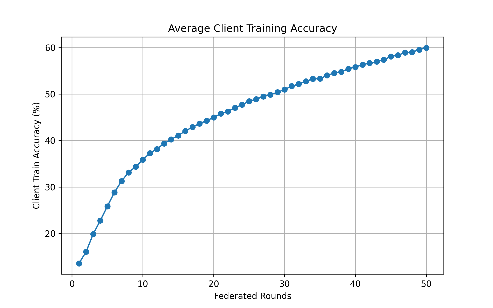
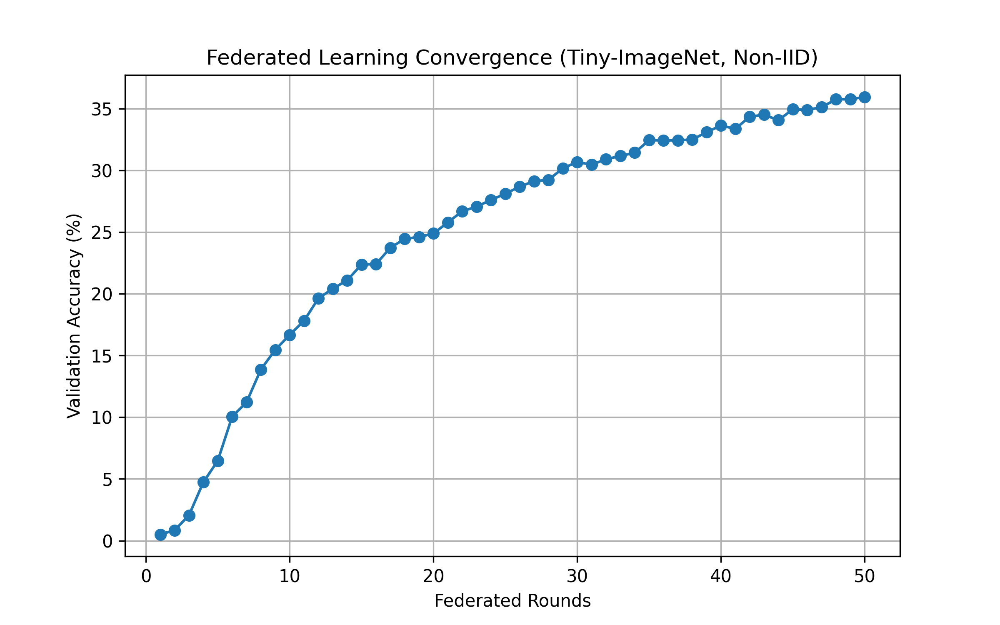
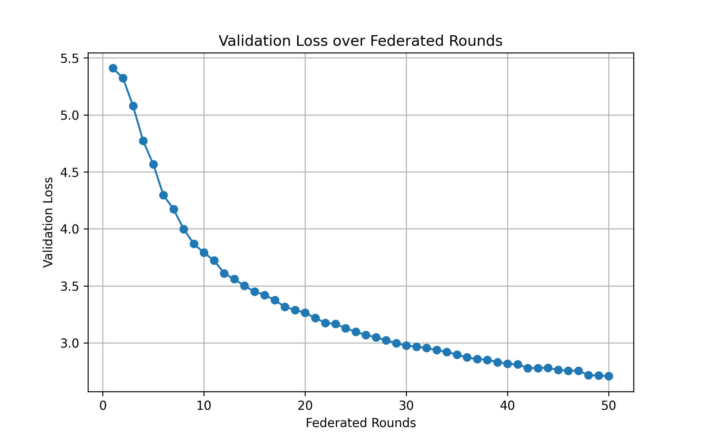
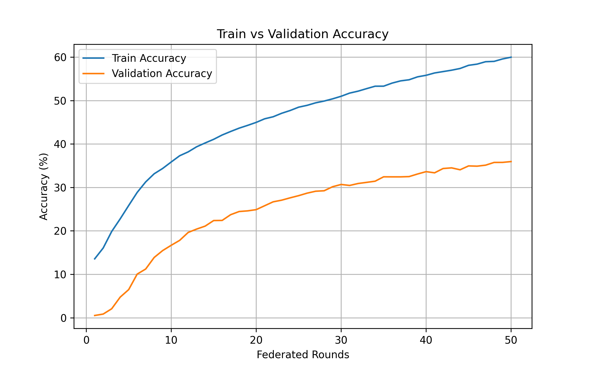

## 📈 Phase 2: Federated Training Baseline
In this phase, we established a robust global baseline model trained under extreme data skew. This serves as the "Pre-unlearning" state for Phase 3.

### Experiment Setup
* **Model Architecture:** ResNet-18 (modified for 64x64 input)
* **Dataset:** Tiny-ImageNet-200
* **Data Partitioning:** Non-IID Dirichlet Distribution ($\alpha = 0.1$)
* **Federated Strategy:** FedAvg
* **Clients:** 10 active clients
* **Communication Rounds:** 50
* **Hyperparameters:** $lr=0.01$, $momentum=0.9$, $batch\_size=32$
=======
### 1. Environment & Model Architecture
* **Model:** `resnet18` (Adapted for 64x64 input, non-pretrained)
* **Dataset:** Tiny-ImageNet-200 (200 unique classes)
* **Hardware:** Local execution via NVIDIA GeForce RTX 3070
>>>>>>> 8bf996dd7 (Docs: Update Phase 2 visuals grid in README)

### 2. Federated Learning Parameters (Extreme Non-IID)
| Configuration | Value |
| :--- | :--- |
| **Total Clients** | 10 |
| **Data Distribution** | **Extreme Non-IID Dirichlet ($\alpha = 0.1$)** |
| **Communication Rounds** | 50 |
| **Batch Size** | 64 (Train) / 128 (Eval) |
| **Optimization** | SGD ($lr=0.01$, $momentum=0.9$, $weight\_decay=0.0005$) |

### 3. Baseline Performance Results
The global model demonstrated steady convergence despite the high data heterogeneity.

* **Max Global Validation Accuracy:** **35.95%**
* **Final Training Loss:** 1.4682
* **Final Training Accuracy:** 59.97%

#### **Phase 2 Federated Training Visualizations**

### 3. Federated Training Visualizations
*The following plots demonstrate the performance metrics across the 50-round baseline training.*

| Client Training Accuracy | Global Validation Accuracy |
| :---: | :---: |
|  |  |
| **Global Validation Loss** | **Train vs Val Comparison** |
|  |  |

---

### 📊 Data Heterogeneity Analysis ($\alpha = 0.1$)
The following table summarizes the data distribution across the 10 clients. The extreme variance in `non_zero_classes` confirms the high difficulty of the Federated Unlearning task.

| Client ID | Total Samples | Non-Zero Classes | Top Contributed Classes |
| :--- | :--- | :--- | :--- |
| **0** | 9,487 | ~82 | Class 131 (472), Class 10 (456), Class 16 (457) |
| **1** | 9,711 | ~91 | Class 138 (435), Class 155 (437), Class 115 (407) |
| **2** | 8,654 | ~88 | Class 162 (485), Class 174 (463), Class 78 (451) |
| **4** | 11,318 | ~102 | Class 6 (493), Class 88 (473), Class 126 (433) |
| **9** | 7,479 | **200** | *Uniform/Noise* (Balanced but low sample count) |

*Note: Client 9 acts as a stabilizer with small counts across all classes, while Clients 0-8 are highly specialized.*

### 📂 Phase 2 Artifacts
All results from this baseline run are stored in the `outputs_phase2/` directory:
* **Models:** `outputs_phase2/checkpoints/global_best.pt`
* **Statistics:** `outputs_phase2/stats/client_class_distribution.csv`
* **Visualizations:** `outputs_phase2/plots/data_heterogeneity_heatmap.png`
---
